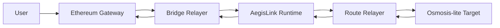

# AegisLink

AegisLink is a local Ethereum-to-Cosmos bridge systems project that proves deposit verification, bridge accounting, routed delivery, and destination-side execution end to end.

It is designed like a protocol, not like a token-transfer demo: Ethereum emits canonical bridge events, AegisLink owns bridge policy and accounting, and routed assets can execute destination-side actions through an Osmosis-style harness.

## In one minute

This repository is meant to show:

- explicit trust assumptions
- clean accounting boundaries
- replay protection and rate limits
- clear module and service separation
- a practical v1 architecture with a light-client roadmap

## What is real today

- Ethereum deposit observation and release execution run through the live local Anvil path.
- Ethereum now has both the original narrow single-attester verifier and a threshold-verifier path with signer-set rotation support.
- AegisLink owns bridge, registry, limits, pauser, and route state in a persistent runtime with `init`, `start`, and `query status`.
- AegisLink bridge attestations now bind to an explicit signer-set version, and the bridge keeper can activate, expire, and reject mismatched signer sets.
- The bridge-relayer and route-relayer are real services with replay persistence and route lifecycle handling.
- The Phase 6 route path now boots a dedicated destination runtime through `osmo-locald`, and `route-relayer` can move a transfer from an AegisLink home into that destination home without the old HTTP mock-target entrypoint.
- Routed transfers go through packet-shaped delivery, destination-side execution, later acknowledgement, and explicit completion, failure, timeout, or refund handling.
- The destination target tracks packets, execution receipts, balances, pools, swaps, and acknowledgement state through public inspection endpoints.

## What is a local harness today

- AegisLink is a persistent Cosmos-inspired runtime, not yet a full networked CometBFT or ABCI chain.
- The Osmosis side is now a dedicated local destination runtime with its own home, config, and state, but it is still not a live IBC-Go or Hermes-connected Osmosis node.
- The verifier model is still a v1 verifiable-relayer plus threshold-attestation path, not a light client.

## Why this project is not a toy

- It uses a dedicated Cosmos bridge zone instead of wiring Ethereum directly into a single destination app.
- It separates observation, verification, policy enforcement, settlement, and routing.
- It proves the full local bridge loop in both directions instead of stopping at inbound minting.
- It treats destination execution as first-class state, including async acknowledgements, swap failures, and refund-safe timeout handling.
- It is honest about the trust model and runtime limits instead of pretending the local harness is a production chain.

## Architecture snapshot



Use [Current flow diagrams](docs/architecture/03-current-flow-diagrams.md) for the fuller end-to-end view and the route lifecycle diagram.

## Documentation map

Start here if you want the basics:

- [Bridge basics](docs/foundations/01-bridge-basics.md)
- [Ethereum, Cosmos, IBC, and Osmosis primer](docs/foundations/02-eth-cosmos-primer.md)

Read these for the protocol design:

- [System architecture](docs/architecture/01-system-architecture.md)
- [Current flow diagrams](docs/architecture/03-current-flow-diagrams.md)
- [Security and trust model](docs/architecture/02-security-and-trust-model.md)
- [Verifier evolution](docs/architecture/04-verifier-evolution.md)
- [Project positioning](docs/project-positioning.md)
- [Architecture spec](docs/superpowers/specs/2026-03-28-eth-cosmos-aegislink-design.md)

Use these to build or review the project step by step:

- [Step-by-step roadmap](docs/implementation/01-step-by-step-roadmap.md)
- [Tech stack and repo plan](docs/implementation/02-tech-stack-and-repo-plan.md)
- [0-to-100 execution plan](docs/superpowers/plans/2026-03-30-aegislink-0-to-100-implementation.md)
- [Final stretch plan](docs/superpowers/plans/2026-04-05-aegislink-final-stretch-plan.md)
- [Future realism plan](docs/superpowers/plans/2026-04-06-aegislink-future-realism-plan.md)
- [Initial implementation plan, historical](docs/superpowers/plans/2026-03-28-eth-cosmos-aegislink-implementation.md)

Use these for operational and launch thinking:

- [Security model summary](docs/security-model.md)
- [Observability plan](docs/observability.md)
- [Demo walkthrough](docs/demo-walkthrough.md)
- [Pause and recovery runbook](docs/runbooks/pause-and-recovery.md)
- [Incident drills](docs/runbooks/incident-drills.md)
- [Upgrade and rollback runbook](docs/runbooks/upgrade-and-rollback.md)

## What AegisLink v1 should say publicly

Use phrasing like:

- "AegisLink v1 is a verifiable-relayer bridge with threshold attestations."
- "AegisLink enforces replay protection, asset registration, rate limits, and pause controls."
- "AegisLink has a roadmap toward stronger Ethereum verification."

Do not describe v1 as fully trustless or fully light-client verified.

## Five-minute demo

If you want the fastest way to show the project working locally, run:

```bash
make demo
```

If you want the inspection-focused path that exercises the public target surfaces:

```bash
make inspect-demo
```

If you want the newer dual-runtime route path that boots both AegisLink and the destination runtime through their own homes:

```bash
make real-demo
make inspect-real-demo
```

That demo exercises:

- a live local Ethereum deposit
- relayer submission into AegisLink
- outbound routing into the Osmosis-style target
- destination-side packet receipt, execution, and swap lifecycle
- public target queries for packets, executions, pools, balances, and swaps

The real Phase 6 route demo exercises:

- destination runtime bootstrap through `scripts/localnet/bootstrap_destination_chain.sh`
- command-backed route delivery into `osmo-locald`
- destination-side balance and packet inspection from the destination home
- source-side completion on the AegisLink SDK-store runtime

For the full walkthrough, use [Demo walkthrough](docs/demo-walkthrough.md).
For the honest reviewer framing, use [Project positioning](docs/project-positioning.md).

## Runtime commands

`aegislinkd` now has a more node-like local runtime surface:

```bash
go run ./chain/aegislink/cmd/aegislinkd init --home /tmp/aegislink-home --chain-id aegislink-devnet-1 --runtime-mode sdk-store-runtime
go run ./chain/aegislink/cmd/aegislinkd start --home /tmp/aegislink-home
go run ./chain/aegislink/cmd/aegislinkd query status --home /tmp/aegislink-home
go run ./chain/aegislink/cmd/aegislinkd query metrics --home /tmp/aegislink-home
go run ./chain/aegislink/cmd/aegislinkd query signer-set --home /tmp/aegislink-home
go run ./chain/aegislink/cmd/aegislinkd query signer-sets --home /tmp/aegislink-home
make test-real-chain
make test-real-ibc
make monitor
```

That flow creates and uses:

- a runtime config file
- a runtime genesis file
- a Cosmos KV-store-backed runtime store
- service-backed `tx` and `query` command paths

## Current checkpoint

As of April 7, 2026:

- the live local Ethereum bridge loop is proven end to end
- Phase 5 is now complete as a single-node SDK-store runtime milestone: AegisLink has store-backed keeper persistence, generated bridge or route proto surfaces, service-backed CLI responses, and a real-chain bootstrap or e2e proof through `aegislinkd init`, `start`, `tx`, and `query`
- Phase 6 is now complete for the current repo scope as a dual-runtime local route milestone: a destination runtime can be bootstrapped through `osmo-locald`, AegisLink can initiate routed transfers through the `ibcrouter` packet lifecycle, and `route-relayer` can drive acknowledgement completion against the destination home without the old HTTP target
- Phase 7 is now complete for the current repo scope: the Ethereum side has a real threshold-verifier path with signer rotation, AegisLink attestations bind to versioned signer sets with activation and expiry rules, and the runtime exposes `query signer-set`, `query signer-sets`, and signer-set status summaries
- the verifier evolution path is now documented explicitly, so the trust-model story is inspectable instead of buried in keeper logic or contract code
- Phase 8 is now complete for the current repo scope: the binaries expose Prometheus-style metrics, the repo ships a local monitoring scaffold, and the main operator recovery drills are codified in runbooks and e2e coverage
- the local monitoring scaffold now exists too: Prometheus scrape config, Grafana provisioning, an initial destination-ops dashboard, and `make monitor`
- Phase 9 is now in progress: the `ibcrouter` can register multiple destination route profiles, each with its own allowed assets and memo-policy guardrails, without changing the older single-route path
- Phase 1 of the fuller route-harness plan is complete
- Phase 3 runtime and operator surfaces now include structured startup and run logs plus clearer runtime validation
- Phase 4 hardening now adds stronger replay and supply invariants, a narrow verifier interface, and demo-facing failure counters
- the routed side now has explicit packet, execution, and acknowledgement lifecycle state
- the next roadmap focus inside Phase 9 is governance-style route and policy changes, with live Docker-backed monitoring boot still worth validating on a machine that has Docker installed

The current repo shape is:

- [chain/aegislink](/Users/ayushns01/Desktop/Repositories/Cross-chain-bridge/chain/aegislink): persistent runtime, bridge state machine, safety modules, and route lifecycle handling
- [contracts/ethereum](/Users/ayushns01/Desktop/Repositories/Cross-chain-bridge/contracts/ethereum): Ethereum event source and release verification contracts
- [relayer](/Users/ayushns01/Desktop/Repositories/Cross-chain-bridge/relayer): observation, attestation, replay, live forward or reverse bridge pipeline, and route-target handoff services

Fresh verification checkpoints that already pass in this repo:

- `go test ./chain/aegislink/...`
- `forge test --offline`
- `go test ./relayer/...`
- `cd tests/e2e && go test ./...`

The local route-harness, operator-surface, SDK-store runtime, dual-runtime route, threshold-verifier, and recovery-drill milestones are now in place. The current active roadmap work is protocol expansion on top of that base: route profiles first, then governed policy changes and richer route actions.
