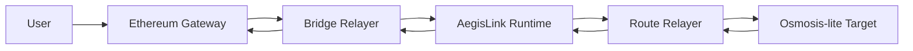

# AegisLink

AegisLink is a local Ethereum-to-Cosmos bridge systems project that proves deposit verification, bridge accounting, routed delivery, and destination-side execution end to end.

It is designed like a protocol, not like a token-transfer demo: Ethereum emits canonical bridge events, AegisLink owns bridge policy and accounting, and routed assets can execute destination-side actions through an Osmosis-style harness.

## In one minute

This repository is meant to show:

- explicit trust assumptions
- clean accounting boundaries
- replay protection and rolling-window rate limits
- clear module and service separation
- a practical v1 architecture with a light-client roadmap

## What is real today

- Ethereum deposit observation and release execution run through the live local Anvil path.
- The real-wallet bridge roadmap is now underway: registry assets distinguish native ETH from ERC-20 custody, the Ethereum gateway supports native ETH deposit and release locally, and AegisLink mints canonical bridged denoms such as `ueth` and `uethusdc`.
- The first public AegisLink testnet scaffold now exists too: `scripts/testnet/bootstrap_aegislink_testnet.sh` boots a reproducible single-validator SDK-store home, and the repo ships operator and network config artifacts under `deploy/testnet/aegislink/`.
- The first public Sepolia wallet bridge scaffold now exists too: `scripts/testnet/deploy_sepolia_bridge.sh`, `scripts/testnet/register_bridge_assets.sh`, and `scripts/testnet/seed_public_bridge_assets.sh` take a Sepolia deployment from contract addresses to a deposit-ready AegisLink home, and `public-bridge-relayer` can now deliver both native ETH and ERC-20 deposits into real AegisLink wallet balances and redeem them back to Sepolia through the live RPC log path.
- The live AegisLink-to-Osmosis IBC leg is now proven too: the single-validator demo node can connect to Osmosis testnet through `rly`, open a real connection and channel, send `ueth` over ICS20, and credit a real `osmo1...` wallet with the resulting `ibc/...` denom.
- The repository now also has a real frontend surface in `web/`: users can connect a Sepolia wallet, choose a Cosmos destination, submit an ETH bridge deposit, and watch bridge progress through to the Osmosis receipt state.
- The public-wallet operator flow is now sharper too: `scripts/testnet/start_public_bridge_backend.sh` can stand up a fresh single-command backend stack, including a seeded demo node, a live Osmosis path, the public bridge relayer, and automatic lifting of stale IBC timeout heights against the live Osmosis LCD height.
- Ethereum now has both the original narrow single-attester verifier and a threshold-verifier path with signer-set rotation support.
- Ethereum verifiers now build EIP-712-style attestation digests, reject non-low-`s` signatures, and the gateway release path is guarded against reentrant token callbacks.
- AegisLink owns bridge, bank, registry, limits, pauser, and route state in a persistent runtime with `init`, `start`, `query status`, and wallet balance queries.
- AegisLink now also has a daemon-style single-node block loop shim in `aegislinkd start --daemon` that advances height automatically and drains queued deposit submissions through the application boundary.
- AegisLink bridge attestations now bind to an explicit signer-set version, carry cryptographic signer proofs, and the bridge keeper can activate, expire, and reject mismatched or invalid signer sets.
- AegisLink rate limits now track rolling-window usage instead of only comparing a single transfer amount to a static ceiling.
- The bridge runtime now exposes a supply-accounting circuit breaker, so corrupted supply state can trip the bridge into an explicit reject-only mode instead of failing silently.
- AegisLink SDK-store persistence now uses prefix-keyed per-record state instead of whole-module JSON blobs, and the app runtime serializes mutations through a single access boundary with focused race-smoke coverage.
- The bridge-relayer and route-relayer are real services with replay persistence and route lifecycle handling.
- The bridge-relayer and route-relayer now also support `--loop` daemon mode with poll intervals, temporary-failure backoff, and repeated run summaries for long-running local operation.
- The Phase 6 route path now boots a dedicated destination runtime through `osmo-locald`, and `route-relayer` can move a transfer from an AegisLink home into that destination home without the old HTTP mock-target entrypoint.
- The Phase E route path now also uses Hermes-shaped local packet verbs: `route-relayer` relays `recv-packet` and later `acknowledge-packet`, while `bootstrap_ibc.sh` writes explicit local IBC link metadata into both runtime homes.
- Routed transfers go through packet-shaped delivery, destination-side execution, later acknowledgement, and explicit completion, failure, timeout, or refund handling.
- The destination target tracks packets, execution receipts, balances, pools, swaps, and acknowledgement state through public inspection endpoints.
- Route profiles can now constrain allowed action types, and the live routed path supports both `swap` and `stake` actions with recipient and path overrides.

## What is a local harness today

- AegisLink is a persistent Cosmos-inspired runtime, not yet a full networked CometBFT or ABCI chain.
- The node lifecycle shim is real enough for the targeted scope, but it is still not a full CometBFT / ABCI / BaseApp runtime.
- The original Osmosis-lite harness is still present as a dedicated local destination runtime with its own home, config, state, and local IBC link metadata.
- The new public IBC path is now real enough to prove a fresh frontend-driven `Sepolia deposit -> AegisLink -> Osmosis testnet wallet` run, but the repo still treats that path as demo-grade. Repeat-run hardening on the long-lived backend, especially around automatic delivery bookkeeping and status resolution, is still ongoing.
- The verifier model is still a v1 verifiable-relayer plus threshold-attestation path, not a light client.

## Why this project is not a toy

- It uses a dedicated Cosmos bridge zone instead of wiring Ethereum directly into a single destination app.
- It separates observation, verification, policy enforcement, settlement, and routing.
- It proves the full local bridge loop in both directions instead of stopping at inbound minting.
- It treats destination execution as first-class state, including async acknowledgements, swap failures, and refund-safe timeout handling.
- It is honest about the trust model and runtime limits instead of pretending the local harness is a production chain.

## Architecture snapshot



Use [Current flow diagrams](docs/architecture/03-current-flow-diagrams.md) for the fuller end-to-end view and the route lifecycle diagram.

## Documentation map

Start here if you want the basics:

- [Bridge basics](docs/foundations/01-bridge-basics.md)
- [Ethereum, Cosmos, IBC, and Osmosis primer](docs/foundations/02-eth-cosmos-primer.md)

Read these for the protocol design:

- [System architecture](docs/architecture/01-system-architecture.md)
- [Current flow diagrams](docs/architecture/03-current-flow-diagrams.md)
- [Security and trust model](docs/architecture/02-security-and-trust-model.md)
- [Verifier evolution](docs/architecture/04-verifier-evolution.md)
- [Project positioning](docs/project-positioning.md)
- [Architecture spec](docs/superpowers/specs/2026-03-28-eth-cosmos-aegislink-design.md)

Use these to build or review the project step by step:

- [Step-by-step roadmap](docs/implementation/01-step-by-step-roadmap.md)
- [Tech stack and repo plan](docs/implementation/02-tech-stack-and-repo-plan.md)
- [0-to-100 execution plan](docs/superpowers/plans/2026-03-30-aegislink-0-to-100-implementation.md)
- [Final stretch plan](docs/superpowers/plans/2026-04-05-aegislink-final-stretch-plan.md)
- [Future realism plan](docs/superpowers/plans/2026-04-06-aegislink-future-realism-plan.md)
- [Gap remediation plan](docs/superpowers/plans/2026-04-08-aegislink-gap-remediation-plan.md)
- [Real wallet asset bridge plan](docs/superpowers/plans/2026-04-11-real-wallet-asset-bridge-plan.md)
- [Initial implementation plan, historical](docs/superpowers/plans/2026-03-28-eth-cosmos-aegislink-implementation.md)

Use these for operational and launch thinking:

- [Security model summary](docs/security-model.md)
- [Observability plan](docs/observability.md)
- [Demo walkthrough](docs/demo-walkthrough.md)
- [Public bridge ops runbook](docs/runbooks/public-bridge-ops.md)
- [Pause and recovery runbook](docs/runbooks/pause-and-recovery.md)
- [Incident drills](docs/runbooks/incident-drills.md)
- [Upgrade and rollback runbook](docs/runbooks/upgrade-and-rollback.md)

## What AegisLink v1 should say publicly

Use phrasing like:

- "AegisLink v1 is a verifiable-relayer bridge with threshold attestations."
- "AegisLink enforces replay protection, asset registration, rolling-window rate limits, and pause controls."
- "AegisLink has a roadmap toward stronger Ethereum verification."

Do not describe v1 as fully trustless or fully light-client verified.

## Five-minute demo

If you want the fastest way to show the project working locally, run:

```bash
make demo
```

If you want the inspection-focused path that exercises the public target surfaces:

```bash
make inspect-demo
```

If you want the newer dual-runtime route path that boots both AegisLink and the destination runtime through their own homes:

```bash
make real-demo
make inspect-real-demo
```

That demo exercises:

- a live local Ethereum deposit
- relayer submission into AegisLink
- outbound routing into the Osmosis-style target
- destination-side packet receipt, execution, and swap lifecycle
- public target queries for packets, executions, pools, balances, and swaps

The real Phase 6 route demo exercises:

- destination runtime bootstrap through `scripts/localnet/bootstrap_destination_chain.sh`
- command-backed route delivery into `osmo-locald`
- destination-side balance and packet inspection from the destination home
- source-side completion on the AegisLink SDK-store runtime

For the full walkthrough, use [Demo walkthrough](docs/demo-walkthrough.md).
For the honest reviewer framing, use [Project positioning](docs/project-positioning.md).

## Runtime commands

`aegislinkd` now has a more node-like local runtime surface:

```bash
go run ./chain/aegislink/cmd/aegislinkd init --home /tmp/aegislink-home --chain-id aegislink-devnet-1 --runtime-mode sdk-store-runtime
go run ./chain/aegislink/cmd/aegislinkd start --home /tmp/aegislink-home
go run ./chain/aegislink/cmd/aegislinkd query status --home /tmp/aegislink-home
go run ./chain/aegislink/cmd/aegislinkd query metrics --home /tmp/aegislink-home
go run ./chain/aegislink/cmd/aegislinkd query signer-set --home /tmp/aegislink-home
go run ./chain/aegislink/cmd/aegislinkd query signer-sets --home /tmp/aegislink-home
make test-real-chain
make test-real-abci
make test-real-ibc
make monitor
```

That flow creates and uses:

- a runtime config file
- a runtime genesis file
- a Cosmos KV-store-backed runtime store
- service-backed `tx` and `query` command paths

## Current checkpoint

As of April 14, 2026:

- the live local Ethereum bridge loop is proven end to end
- Phase 5 is now complete as a single-node SDK-store runtime milestone: AegisLink has store-backed keeper persistence, generated bridge or route proto surfaces, service-backed CLI responses, and a real-chain bootstrap or e2e proof through `aegislinkd init`, `start`, `tx`, and `query`
- Phase 6 is now complete for the current repo scope as a dual-runtime local route milestone: a destination runtime can be bootstrapped through `osmo-locald`, AegisLink can initiate routed transfers through the `ibcrouter` packet lifecycle, and `route-relayer` can drive acknowledgement completion against the destination home without the old HTTP target
- Phase 7 is now complete for the current repo scope: the Ethereum side has a real threshold-verifier path with signer rotation, AegisLink attestations bind to versioned signer sets with activation and expiry rules, and the runtime exposes `query signer-set`, `query signer-sets`, and signer-set status summaries
- the verifier evolution path is now documented explicitly, so the trust-model story is inspectable instead of buried in keeper logic or contract code
- Phase 8 is now complete for the current repo scope: the binaries expose Prometheus-style metrics, the repo ships a local monitoring scaffold, and the main operator recovery drills are codified in runbooks and e2e coverage
- the local monitoring scaffold now exists too: Prometheus scrape config, Grafana provisioning, an initial destination-ops dashboard, and `make monitor`
- Phase 9 is now complete for the current repo scope: the `ibcrouter` can register multiple destination route profiles with allowed assets, memo-policy guardrails, and allowed action types, the governance module can apply asset, limit, and route-policy changes through a recorded proposal path, and the routed execution layer now supports both `swap` and `stake`
- Phase A of the gap-remediation plan is now complete for the current repo scope: Go-side bridge verification now requires cryptographic signer proofs instead of signer-name lists, and governance policy changes now require an explicit configured authority
- Phase B of the gap-remediation plan is now complete for the current repo scope: bridge volume controls now use persisted rolling-window usage tracking, and the bridge runtime now trips a visible circuit breaker when accounting invariants are violated
- Phase C of the gap-remediation plan is now complete for the current repo scope: chain state is persisted as prefix-keyed SDK-store records instead of whole-module JSON blobs, disk-backed runtime reloads are covered, and the app exposes a serialized runtime boundary with race-smoke coverage
- Phase D of the gap-remediation plan is now complete for the current repo scope: bridge and route relayers can run as loop-based daemons with graceful shutdown and temporary-failure backoff, and the repo now has focused Foundry invariant coverage plus Go fuzz coverage for bridge supply and route-refund safety
- Phase E of the gap-remediation plan is now complete for the current repo scope: AegisLink has a daemon-style single-node block loop with queued deposit delivery through the app boundary, and the dual-runtime route path now uses Hermes-shaped local packet relay and acknowledgement verbs plus explicit `ibc-link.json` metadata in both runtime homes
- Phase F of the gap-remediation plan is now complete for the current repo scope: the Ethereum verifier path now uses typed-data-style digests, rejects non-low-`s` signatures, the gateway release flow is reentrancy-guarded, and the v1 upgradeability stance is documented explicitly as immutable or non-proxy by design
- the gap-remediation plan is now complete for the current repo scope
- Phase 1 of the fuller route-harness plan is complete
- Phase 3 runtime and operator surfaces now include structured startup and run logs plus clearer runtime validation
- Phase 4 hardening now adds stronger replay and supply invariants, a narrow verifier interface, and demo-facing failure counters
- the routed side now has explicit packet, execution, and acknowledgement lifecycle state
- the next roadmap focus is deeper realism beyond the completed phase set: pushing AegisLink from the current daemon shim toward a fuller networked CometBFT or BaseApp runtime, replacing the current Hermes-shaped local bridge with fuller real IBC-Go or Hermes-backed networking, and validating the monitoring stack on a machine that has Docker installed
- the public-wallet bridge plan is now implemented through Phase J for the current repo scope: native ETH and ERC-20 custody are modeled explicitly, AegisLink can mint bridged balances into a real Bech32 wallet, the public-testnet scaffold and Sepolia deployment scripts are in place, and the public relayer now covers both deposit delivery and redeem-back-to-Sepolia flows
- Phase K now has a live public IBC proof for the current repo scope: `.env.public-ibc.local.example`, `scripts/testnet/bootstrap_public_ibc.sh`, and `scripts/testnet/bootstrap_rly_path.sh` can bootstrap the route metadata, and the single-validator AegisLink demo node has now opened a real Osmosis testnet channel and delivered `ueth` to a real `osmo1...` wallet over `rly`
- the repository now also has a premium black-and-white frontend in `web/` plus a one-command public backend launcher, so the public demo path is no longer only a CLI exercise
- a fresh frontend-driven `Sepolia -> AegisLink -> Osmosis` run is now proven in the current repo scope
- the remaining public-wallet gap is now narrower and more operational: repeated frontend-driven runs on one long-lived backend still need more hardening around auto-delivery idempotency and receipt/status bookkeeping

The current repo shape is:

- [chain/aegislink](chain/aegislink): persistent runtime, bridge state machine, safety modules, and route lifecycle handling
- [contracts/ethereum](contracts/ethereum): Ethereum event source and release verification contracts
- [relayer](relayer): observation, attestation, replay, live forward or reverse bridge pipeline, and route-target handoff services

Fresh verification checkpoints that already pass in this repo:

- `go test ./chain/aegislink/...`
- `forge test --offline`
- `go test ./relayer/...`
- `cd tests/e2e && go test ./...`

The local route-harness, operator-surface, SDK-store runtime, dual-runtime route, threshold-verifier, recovery-drill, and protocol-expansion milestones are now in place. The next realism work from here is deeper networked chain and IBC integration rather than more local-harness breadth.
