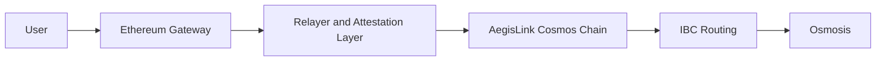

# AegisLink

AegisLink is an Ethereum-to-Cosmos interoperability project. It is designed as a protocol: Ethereum emits canonical bridge events, a custom Cosmos-SDK bridge zone verifies threshold-attested claims, and phase 2 routes supported assets to Osmosis over IBC for real swaps and liquidity.

The point of this repository is to show:

- explicit trust assumptions
- clean accounting boundaries
- replay protection and rate limits
- clear module and service separation
- a practical v1 architecture with a light-client roadmap

## Why this project is strong

- It uses a dedicated Cosmos bridge zone instead of wiring Ethereum directly into a single destination app.
- It separates observation, verification, policy enforcement, settlement, and routing.
- It is honest about the v1 trust model: verifiable relayer plus threshold attestations, not a fully trustless light client.
- It shows a real downstream use case through Osmosis instead of stopping at "asset arrived."
- It scales architecturally: once Ethereum to AegisLink is solved well, the Cosmos side can expand through IBC.

## Architecture snapshot



## Phases

### Phase 1

Build Ethereum `<->` AegisLink:

- Ethereum gateway contracts
- AegisLink Cosmos-SDK chain
- threshold-attested claim verification
- registry, replay protection, pause controls, and rate limits
- local end-to-end tests

### Phase 2

Route supported assets from AegisLink to Osmosis:

- IBC channel setup
- asset routing policy
- swap and liquidity demo path
- operational runbooks and observability

## Documentation map

Start here if you want the basics:

- [Bridge basics](docs/foundations/01-bridge-basics.md)
- [Ethereum, Cosmos, IBC, and Osmosis primer](docs/foundations/02-eth-cosmos-primer.md)

Read these for the protocol design:

- [System architecture](docs/architecture/01-system-architecture.md)
- [Security and trust model](docs/architecture/02-security-and-trust-model.md)
- [Architecture spec](docs/superpowers/specs/2026-03-28-eth-cosmos-aegislink-design.md)

Use these to build the project step by step:

- [Step-by-step roadmap](docs/implementation/01-step-by-step-roadmap.md)
- [Tech stack and repo plan](docs/implementation/02-tech-stack-and-repo-plan.md)
- [0-to-100 execution plan](docs/superpowers/plans/2026-03-30-aegislink-0-to-100-implementation.md)
- [Final stretch plan](docs/superpowers/plans/2026-04-05-aegislink-final-stretch-plan.md)
- [Initial implementation plan, historical](docs/superpowers/plans/2026-03-28-eth-cosmos-aegislink-implementation.md)

Use these for operational and launch thinking:

- [Security model summary](docs/security-model.md)
- [Observability plan](docs/observability.md)
- [Demo walkthrough](docs/demo-walkthrough.md)
- [Pause and recovery runbook](docs/runbooks/pause-and-recovery.md)
- [Upgrade and rollback runbook](docs/runbooks/upgrade-and-rollback.md)

## What AegisLink v1 should say publicly

Use phrasing like:

- "AegisLink v1 is a verifiable-relayer bridge with threshold attestations."
- "AegisLink enforces replay protection, asset registration, rate limits, and pause controls."
- "AegisLink has a roadmap toward stronger Ethereum verification."

Do not describe v1 as fully trustless or fully light-client verified.

## Five-minute demo

If you want the fastest way to show the project working locally, run:

```bash
make demo
```

If you want the inspection-focused path that exercises the public target surfaces:

```bash
make inspect-demo
```

That demo exercises:

- a live local Ethereum deposit
- relayer submission into AegisLink
- outbound routing into the Osmosis-style target
- destination-side packet receipt, execution, and swap lifecycle
- public target queries for packets, executions, pools, balances, and swaps

For the full walkthrough, use [Demo walkthrough](docs/demo-walkthrough.md).

## Runtime commands

`aegislinkd` now has a more node-like local runtime surface:

```bash
go run ./chain/aegislink/cmd/aegislinkd init --home /tmp/aegislink-home --chain-id aegislink-devnet-1
go run ./chain/aegislink/cmd/aegislinkd start --home /tmp/aegislink-home
go run ./chain/aegislink/cmd/aegislinkd query status --home /tmp/aegislink-home
```

That flow creates and uses:

- a runtime config file
- a runtime genesis file
- a persisted runtime state file

## Current checkpoint

As of April 5, 2026, AegisLink is a runtime-backed local bridge prototype with a live local Ethereum bridge loop and an Osmosis-style routed execution harness, not just a design repo. The repository now includes:

- a persistent AegisLink runtime with `bridge`, `registry`, `limits`, `pauser`, and `ibcrouter` modules plus CLI query and tx surfaces
- a more node-like `aegislinkd` runtime with `init`, `start`, runtime config resolution, and `query status`
- Ethereum gateway and verifier contracts with Foundry tests
- a relayer pipeline with replay persistence, command-backed AegisLink integration, RPC-backed Ethereum deposit observation, and RPC-backed Ethereum release execution
- end-to-end tests that prove the full local bridge loop from Ethereum deposit to Ethereum release
- a dedicated `route-relayer` plus `mock-osmosis-target` service pair that delivers packet-shaped routed transfers and resolves acknowledgements asynchronously
- route lifecycle support for pending, completed, failed, timed-out, and refunded Osmosis-style transfers
- a routed-flow proof that takes a live Ethereum deposit, mints on AegisLink, initiates a route, hands it to a local target, and ends in a completed transfer record on the AegisLink side
- a destination-side packet lifecycle that now moves through `received`, `executed`, `ack_ready`, and `ack_relayed`
- packet receipts, separate execution receipts, denom-trace-style metadata, recipient balances, configurable multi-pool swap execution records, fee-aware pricing, and execution-driven `ack_failed` outcomes on the local Osmosis-style target
- public mock-target query surfaces for `/status`, `/packets`, `/executions`, `/pools`, `/balances`, and `/swaps`

The current repo shape is:

- [chain/aegislink](/Users/ayushns01/Desktop/Repositories/Cross-chain-bridge/chain/aegislink): persistent runtime, bridge state machine, safety modules, and route lifecycle handling
- [contracts/ethereum](/Users/ayushns01/Desktop/Repositories/Cross-chain-bridge/contracts/ethereum): Ethereum event source and release verification contracts
- [relayer](/Users/ayushns01/Desktop/Repositories/Cross-chain-bridge/relayer): observation, attestation, replay, live forward or reverse bridge pipeline, and route-target handoff services

Fresh verification checkpoints that already pass in this repo:

- `go test ./chain/aegislink/...`
- `forge test --offline`
- `go test ./relayer/...`
- `cd tests/e2e && go test ./...`

The next active roadmap task is still inside `Task 9`: replace the current local route target with a fuller local IBC or Osmosis harness. A separate hardening track is still worth doing before public demos: moving AegisLink from a persistent runtime shell toward a fuller Cosmos node runtime.
