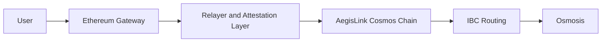

# AegisLink

AegisLink is an Ethereum-to-Cosmos interoperability project. It is designed as a protocol: Ethereum emits canonical bridge events, a custom Cosmos-SDK bridge zone verifies threshold-attested claims, and phase 2 routes supported assets to Osmosis over IBC for real swaps and liquidity.

The point of this repository is to show:

- explicit trust assumptions
- clean accounting boundaries
- replay protection and rate limits
- clear module and service separation
- a practical v1 architecture with a light-client roadmap

## Why this project is strong

- It uses a dedicated Cosmos bridge zone instead of wiring Ethereum directly into a single destination app.
- It separates observation, verification, policy enforcement, settlement, and routing.
- It is honest about the v1 trust model: verifiable relayer plus threshold attestations, not a fully trustless light client.
- It shows a real downstream use case through Osmosis instead of stopping at "asset arrived."
- It scales architecturally: once Ethereum to AegisLink is solved well, the Cosmos side can expand through IBC.

## Architecture snapshot

## Phases

### Phase 1

Build Ethereum `<->` AegisLink:

- Ethereum gateway contracts
- AegisLink Cosmos-SDK chain
- threshold-attested claim verification
- registry, replay protection, pause controls, and rate limits
- local end-to-end tests

### Phase 2

Route supported assets from AegisLink to Osmosis:

- IBC channel setup
- asset routing policy
- swap and liquidity demo path
- operational runbooks and observability

## Documentation map

Start here if you want the basics:

- [Bridge basics](docs/foundations/01-bridge-basics.md)
- [Ethereum, Cosmos, IBC, and Osmosis primer](docs/foundations/02-eth-cosmos-primer.md)

Read these for the protocol design:

- [System architecture](docs/architecture/01-system-architecture.md)
- [Security and trust model](docs/architecture/02-security-and-trust-model.md)
- [Architecture spec](docs/superpowers/specs/2026-03-28-eth-cosmos-aegislink-design.md)

Use these to build the project step by step:

- [Step-by-step roadmap](docs/implementation/01-step-by-step-roadmap.md)
- [Tech stack and repo plan](docs/implementation/02-tech-stack-and-repo-plan.md)
- [Implementation plan](docs/superpowers/plans/2026-03-28-eth-cosmos-aegislink-implementation.md)
- [0-to-100 execution plan](docs/superpowers/plans/2026-03-30-aegislink-0-to-100-implementation.md)

Use these for operational and launch thinking:

- [Security model summary](docs/security-model.md)
- [Observability plan](docs/observability.md)
- [Pause and recovery runbook](docs/runbooks/pause-and-recovery.md)
- [Upgrade and rollback runbook](docs/runbooks/upgrade-and-rollback.md)

## What AegisLink v1 should say publicly

Use phrasing like:

- "AegisLink v1 is a verifiable-relayer bridge with threshold attestations."
- "AegisLink enforces replay protection, asset registration, rate limits, and pause controls."
- "AegisLink has a roadmap toward stronger Ethereum verification."

Do not describe v1 as fully trustless or fully light-client verified.

## Repository status

This repository currently starts from documentation and architecture first. The next step is to scaffold the monorepo described in the implementation plan and build the system incrementally from the bridge zone core outward.
