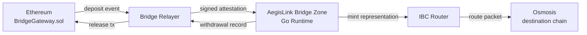

# AegisLink — Complete Project Walkthrough

> **Purpose**: This document explains every component, data flow, and design decision in the AegisLink project. Read this to deeply understand what you built and why, so you can confidently explain it in any technical interview.

---

## 1. WHAT IS AEGISLINK?

AegisLink is a **cross-chain bridge** that lets users move assets between **Ethereum** and a **Cosmos-inspired bridge zone**, with onward routing to destination chains like **Osmosis**.

In simple terms:
1. A user deposits USDC on Ethereum
2. Relayers observe the deposit, collect threshold attestations, and submit proof to the bridge zone
3. The bridge zone verifies the cryptographic proof, checks policies, and mints a representation token
4. The representation can be routed onward to Osmosis via IBC-like routing
5. The user can also withdraw: burn the representation on the bridge zone, and the relayers release the original USDC back on Ethereum



---

## 2. THE THREE LAYERS

The project has three distinct layers. Think of them as three separate systems that communicate through well-defined interfaces:

### Layer 1: Ethereum Smart Contracts (Solidity/Foundry)
**Where**: `contracts/ethereum/`
**What**: Handles the Ethereum side — accepting deposits, releasing withdrawals, verifying attestation signatures.

### Layer 2: AegisLink Bridge Zone (Go)
**Where**: `chain/aegislink/`
**What**: The "brain" of the bridge — verifies cryptographic attestations, enforces policies (rate limits, pause controls, asset registry), manages supply accounting, routes assets to destination chains.

### Layer 3: Relayer Services (Go)
**Where**: `relayer/`
**What**: Off-chain services that observe events on both chains and relay them. Think of relayers as messengers — they carry evidence but don't determine truth.

---

## 3. COMPLETE DATA FLOW: DEPOSIT (Ethereum → AegisLink)

Here is exactly what happens when a user deposits USDC on Ethereum:

### Step 1: User calls `deposit()` on Ethereum

**File**: [BridgeGateway.sol](file:///Users/ayushns01/Desktop/Repositories/Cross-chain-bridge/contracts/ethereum/BridgeGateway.sol)

```
User → BridgeGateway.deposit(token, amount, cosmosRecipient, expiry)
```

The gateway:
1. Checks the asset is supported and not paused
2. Records `balanceBefore = token.balanceOf(gateway)`
3. Calls `token.transferFrom(user, gateway, amount)`
4. Records `balanceAfter = token.balanceOf(gateway)`
5. **Asserts `balanceAfter - balanceBefore == amount`** — this catches fee-on-transfer tokens that silently take a cut
6. Emits a `Deposited` event with all the details
7. Increments a nonce to prevent replay

### Step 2: Relayer observes the deposit event

**File**: [relayer/internal/evm/](file:///Users/ayushns01/Desktop/Repositories/Cross-chain-bridge/relayer/internal/evm/)

The bridge relayer polls Ethereum for new `Deposited` events:
- `evm.Watcher` calls `evm.Client` which uses either:
  - `FileLogSource` — reads from a local JSON file (for testing)
  - `RPCLogSource` — polls a real Ethereum RPC (for live Anvil/testnet)
- It waits for `EVMConfirmations` block confirmations before processing
- Each event is converted to a `DepositEvent` struct

### Step 3: Relayer collects attestation signatures

**File**: [relayer/internal/attestations/collector.go](file:///Users/ayushns01/Desktop/Repositories/Cross-chain-bridge/relayer/internal/attestations/collector.go)

The collector:
1. Reads votes from a vote state file (or would query other relayers in production)
2. Filters votes that match the `messageID` and `payloadHash`
3. Checks that enough votes meet the `threshold` requirement
4. **Signs each vote with a real secp256k1 private key** to produce `AttestationProof` structs
5. Packages everything into an `Attestation` with proofs, threshold, expiry, and signer set version

### Step 4: Relayer submits the claim to AegisLink

**File**: [relayer/internal/pipeline/pipeline.go](file:///Users/ayushns01/Desktop/Repositories/Cross-chain-bridge/relayer/internal/pipeline/pipeline.go)

The `Coordinator.runDeposits()` method:
1. Calls `depositWatcher.Observe()` to get new events
2. Checks `replay.Store.IsProcessed()` to skip duplicates
3. Builds a `DepositClaim` from the event
4. Calls `collector.Collect()` to get the attestation
5. Calls `submitter.SubmitDepositClaim()` with retry logic
6. Marks the event as processed in the replay store
7. Saves the checkpoint cursor so restarts don't re-process

### Step 5: AegisLink verifies and accepts the claim

**File**: [chain/aegislink/x/bridge/keeper/keeper.go](file:///Users/ayushns01/Desktop/Repositories/Cross-chain-bridge/chain/aegislink/x/bridge/keeper/keeper.go) → `ExecuteDepositClaim()`

This is the most important function in the entire project. Here's what it does, in order:

1. **Circuit breaker check**: `ensureCircuitHealthy()` — if a previous invariant violation tripped the circuit breaker, reject everything
2. **Input validation**: `claim.ValidateBasic()` — checks all fields are present, message ID matches derived hash
3. **Replay protection**: checks `processedClaims[claimKey]` — rejects duplicate claims
4. **Attestation verification**: `verifyDepositClaim()` — this is the cryptographic core:
   - Validates attestation envelope (message ID, payload hash, threshold, expiry)
   - Checks message ID and payload hash match the claim
   - Checks finality window hasn't expired
   - Checks attestation hasn't expired
   - Gets the active signer set, verifies version matches
   - **Computes the signing digest** from the attestation fields
   - **For each proof**: calls `ecdsa.RecoverCompact(signature, digest)` to recover the public key, derives the Ethereum-style address, checks it matches the claimed signer AND is in the active signer set
   - Counts verified signers, ensures they meet the threshold
5. **Asset registry check**: looks up the asset in the registry, ensures it's enabled
6. **Pause check**: `pauserKeeper.AssertNotPaused()` — checks the asset isn't emergency-paused
7. **Rate limit check**: `limitsKeeper.CheckTransferAtHeight()` — checks the sliding window hasn't exceeded capacity
8. **Rate limit record**: `limitsKeeper.RecordTransferAtHeight()` — records this transfer in the window
9. **Mint representation**: `mintRepresentation(denom, amount)` — adds to the supply ledger
10. **Record claim**: stores the claim in `processedClaims`
11. **Invariant check**: `CheckAccountingInvariant()` — verifies `sum(accepted_deposits) - sum(withdrawals) == current_supply` for every denom. If this ever fails, trips the circuit breaker.
12. **Persist**: writes state to storage

---

## 4. COMPLETE DATA FLOW: WITHDRAWAL (AegisLink → Ethereum)

### Step 1: Withdrawal is executed on AegisLink

**File**: [keeper.go](file:///Users/ayushns01/Desktop/Repositories/Cross-chain-bridge/chain/aegislink/x/bridge/keeper/keeper.go) → `ExecuteWithdrawal()`

1. Circuit breaker check
2. Input validation (positive amount, valid recipient, non-zero deadline, signature present)
3. Asset registry + pause + rate limit checks (same as deposit)
4. **Supply sufficiency check**: ensures `currentSupply >= amount`
5. **Burn representation**: `burnRepresentation(denom, amount)` — subtracts from supply
6. Creates a `WithdrawalRecord` with a unique identity (block height, nonce, message ID)
7. Invariant check + persist

### Step 2: Relayer observes the withdrawal

**File**: [relayer/internal/pipeline/pipeline.go](file:///Users/ayushns01/Desktop/Repositories/Cross-chain-bridge/relayer/internal/pipeline/pipeline.go) → `runWithdrawals()`

The relayer polls the bridge zone for new withdrawals using `withdrawalWatcher.Observe()`, then calls `evmRelease.ReleaseWithdrawal()`.

### Step 3: Release on Ethereum

**File**: [BridgeGateway.sol](file:///Users/ayushns01/Desktop/Repositories/Cross-chain-bridge/contracts/ethereum/BridgeGateway.sol) → `release()`

1. Checks reentrancy lock (`_releaseStatus`)
2. Calls `verifier.verifyAndConsume(messageId, payloadHash, expiry, proof)`:
   - **BridgeVerifier**: recovers signer via `ecrecover` with EIP-712 structured data, checks it matches the attester, marks proof as used
   - **ThresholdBridgeVerifier**: same but requires multiple signatures meeting a threshold, validates signer set version
3. Transfers tokens to recipient via `_transferOut()`
4. Verifies canonical transfer (balance check)
5. Emits `Released` event

---

## 5. COMPLETE DATA FLOW: ROUTING (AegisLink → Osmosis)

### Step 1: Initiate IBC transfer on AegisLink

**File**: [ibcrouter/keeper/keeper.go](file:///Users/ayushns01/Desktop/Repositories/Cross-chain-bridge/chain/aegislink/x/ibcrouter/keeper/keeper.go) → `InitiateTransfer()`

1. Finds the route for the asset (which destination chain, which channel, which destination denom)
2. If a route profile exists, enforces policy (allowed memo prefixes, allowed action types, allowed assets)
3. Creates a `TransferRecord` with status `pending`
4. Assigns a unique `transferID`

### Step 2: Route relayer delivers the packet

**File**: [relayer/internal/route/relay.go](file:///Users/ayushns01/Desktop/Repositories/Cross-chain-bridge/relayer/internal/route/relay.go)

The route relayer:
1. Queries AegisLink for pending transfers
2. Builds an IBC-like packet with denom trace and memo
3. Delivers the packet to the mock Osmosis target
4. On the next run, polls for acknowledgements (success, failure, timeout)
5. Updates the transfer status on AegisLink accordingly

### Step 3: Destination execution

**File**: [relayer/internal/route/mock_target.go](file:///Users/ayushns01/Desktop/Repositories/Cross-chain-bridge/relayer/internal/route/mock_target.go)

The mock Osmosis target:
1. Receives the IBC packet
2. Parses the memo (`swap:uosmo`, `swap:uosmo:min_out=50000000`)
3. Executes the swap using a constant-product AMM formula
4. Records balances, pool state, and execution results
5. Returns success/failure acknowledgement

### Transfer lifecycle states:
```
pending → completed     (normal success)
pending → ack_failed    (swap failed, e.g. min_out not met)
pending → timed_out     (destination didn't respond)
ack_failed → refunded   (manual recovery)
timed_out → refunded    (manual recovery)
```

---

## 6. FILE-BY-FILE GUIDE

### Ethereum Contracts (`contracts/ethereum/`)

| File | Purpose |
|------|---------|
| [IBridgeVerifier.sol](file:///Users/ayushns01/Desktop/Repositories/Cross-chain-bridge/contracts/ethereum/IBridgeVerifier.sol) | Interface that defines `verifyAndConsume()` — the gateway calls this to verify attestations |
| [BridgeGateway.sol](file:///Users/ayushns01/Desktop/Repositories/Cross-chain-bridge/contracts/ethereum/BridgeGateway.sol) | **Core gateway contract**. Handles `deposit()` and `release()`. Owns the token custody. Uses verifier for attestation. Has reentrancy guard, fee-on-transfer protection, pause control. |
| [BridgeVerifier.sol](file:///Users/ayushns01/Desktop/Repositories/Cross-chain-bridge/contracts/ethereum/BridgeVerifier.sol) | **Single-attester verifier**. Uses EIP-712 typed signing. Recovers signer via `ecrecover`. Has `s`-value malleability protection (`SECP256K1_HALF_N`). Tracks used proofs. |
| [ThresholdBridgeVerifier.sol](file:///Users/ayushns01/Desktop/Repositories/Cross-chain-bridge/contracts/ethereum/ThresholdBridgeVerifier.sol) | **Multi-signer verifier**. Requires `threshold` valid signatures from the active signer set. Supports signer set rotation with version binding. Detects duplicate signers. |
| [test/BridgeGateway.t.sol](file:///Users/ayushns01/Desktop/Repositories/Cross-chain-bridge/contracts/ethereum/test/BridgeGateway.t.sol) | Unit tests for deposits, releases, pauses, fee-on-transfer rejection, canonical transfer checks |
| [test/ThresholdBridgeVerifier.t.sol](file:///Users/ayushns01/Desktop/Repositories/Cross-chain-bridge/contracts/ethereum/test/ThresholdBridgeVerifier.t.sol) | Tests for threshold release, insufficient signatures, duplicate signers, signer rotation |
| [test/BridgeGateway.invariant.t.sol](file:///Users/ayushns01/Desktop/Repositories/Cross-chain-bridge/contracts/ethereum/test/BridgeGateway.invariant.t.sol) | **Foundry invariant test** — randomized deposit/release sequences asserting `gateway_balance == initial + deposited - released` |

---

### Chain Runtime (`chain/aegislink/`)

#### App Layer (`chain/aegislink/app/`)

| File | Purpose |
|------|---------|
| [app.go](file:///Users/ayushns01/Desktop/Repositories/Cross-chain-bridge/chain/aegislink/app/app.go) | **Main application struct**. Owns all keepers. Has `sync.RWMutex` for thread safety. Methods: `SubmitDepositClaim`, `ExecuteWithdrawal`, `InitiateIBCTransfer`, `Pause`/`Unpause`, `Status`, `Save`, `Load`, `AdvanceBlock`. |
| [config.go](file:///Users/ayushns01/Desktop/Repositories/Cross-chain-bridge/chain/aegislink/app/config.go) | Configuration management. `InitHome()` creates home directory with config.json, genesis.json, and state. `ResolveConfig()` merges stored + explicit config. |
| [service.go](file:///Users/ayushns01/Desktop/Repositories/Cross-chain-bridge/chain/aegislink/app/service.go) | Service layer with thread-safe wrappers: `BridgeQueryService` (read claims, withdrawals, signer sets), `BridgeTxService` (submit claims, execute withdrawals), `GovernanceTxService` (apply proposals), `IBCRouterQueryService` (list routes, transfers). |
| [store_runtime.go](file:///Users/ayushns01/Desktop/Repositories/Cross-chain-bridge/chain/aegislink/app/store_runtime.go) | Creates the LevelDB-backed store with IAVL trees for each module. Uses `cosmossdk.io/store/rootmulti` for the multi-store. |
| [runtime_state.go](file:///Users/ayushns01/Desktop/Repositories/Cross-chain-bridge/chain/aegislink/app/runtime_state.go) | JSON-file based state persistence (for the non-SDK-store runtime mode). Exports/imports all module state. |
| [node.go](file:///Users/ayushns01/Desktop/Repositories/Cross-chain-bridge/chain/aegislink/app/node.go) | ABCI-like block production. `QueuedDepositClaim` for pending claims. `BlockProgress` for height advancement. `AdvanceBlock()` drains queued claims and increments height. |

#### Bridge Module (`chain/aegislink/x/bridge/`)

| File | Purpose |
|------|---------|
| [keeper/keeper.go](file:///Users/ayushns01/Desktop/Repositories/Cross-chain-bridge/chain/aegislink/x/bridge/keeper/keeper.go) | **Core bridge logic**. `ExecuteDepositClaim()` — the 12-step verification pipeline. `ExecuteWithdrawal()` — burn + record. State export/import. Prefix-store persistence. |
| [keeper/verify_attestation.go](file:///Users/ayushns01/Desktop/Repositories/Cross-chain-bridge/chain/aegislink/x/bridge/keeper/verify_attestation.go) | **Cryptographic verification**. Computes signing digest, iterates proofs, calls `verifyProof()`, counts valid signers against threshold. |
| [keeper/verify_signature.go](file:///Users/ayushns01/Desktop/Repositories/Cross-chain-bridge/chain/aegislink/x/bridge/keeper/verify_signature.go) | **ECDSA recovery**. `ecdsa.RecoverCompact(signature, digest)` → recover public key → derive Ethereum address → compare with claimed signer. |
| [keeper/accounting.go](file:///Users/ayushns01/Desktop/Repositories/Cross-chain-bridge/chain/aegislink/x/bridge/keeper/accounting.go) | Supply management. `mintRepresentation()` adds to supply. `burnRepresentation()` subtracts with underflow check. `ClaimRecord` and `WithdrawalRecord` types. `cloneAmount()` prevents aliasing. |
| [keeper/invariants.go](file:///Users/ayushns01/Desktop/Repositories/Cross-chain-bridge/chain/aegislink/x/bridge/keeper/invariants.go) | **Circuit breaker**. `CheckAccountingInvariant()` rebuilds expected supply from claims - withdrawals, compares to actual. `tripCircuit()` halts all bridge operations if mismatched. |
| [keeper/signer_set.go](file:///Users/ayushns01/Desktop/Repositories/Cross-chain-bridge/chain/aegislink/x/bridge/keeper/signer_set.go) | Signer set lifecycle. `UpsertSignerSet()`, `ActiveSignerSet()`, `ExpireSignerSet()`. Supports multiple versions with activation timestamps. |
| [keeper/state.go](file:///Users/ayushns01/Desktop/Repositories/Cross-chain-bridge/chain/aegislink/x/bridge/keeper/state.go) | State serialization. `ExportState()` / `ImportState()` for JSON persistence. Prefix-store save/load for SDK-store mode. |
| [types/claim.go](file:///Users/ayushns01/Desktop/Repositories/Cross-chain-bridge/chain/aegislink/x/bridge/types/claim.go) | Claim types. `ClaimIdentity` (kind, source chain, tx hash, log index, nonce, message ID). `DepositClaim` and `WithdrawalClaim`. `ValidateBasic()` ensures derived message ID matches. `Digest()` for attestation binding. |
| [types/attestation.go](file:///Users/ayushns01/Desktop/Repositories/Cross-chain-bridge/chain/aegislink/x/bridge/types/attestation.go) | Attestation envelope. `ValidateBasic()` checks proofs present, no duplicates, signatures non-empty. |
| [types/proof.go](file:///Users/ayushns01/Desktop/Repositories/Cross-chain-bridge/chain/aegislink/x/bridge/types/proof.go) | **Cryptographic signing primitives**. `SigningDigest()` — canonical pipe-delimited Keccak hash. `SignAttestationWithPrivateKeyHex()` — sign with secp256k1. `SignerAddressFromPublicKey()` — Ethereum-style Keccak address derivation. Harness test signers with known private keys. |
| [types/keys.go](file:///Users/ayushns01/Desktop/Repositories/Cross-chain-bridge/chain/aegislink/x/bridge/types/keys.go) | Deterministic key derivation. `ReplayKey()` and `ClaimDigest()` functions that produce collision-resistant identifiers from claim fields. |
| [keeper/fuzz_test.go](file:///Users/ayushns01/Desktop/Repositories/Cross-chain-bridge/chain/aegislink/x/bridge/keeper/fuzz_test.go) | **Go fuzz test**. `FuzzBridgeSupplyNeverGoesNegative` — random deposit/withdrawal amounts, asserts supply never goes negative and insufficient-supply errors fire correctly. |

#### Other Modules

| Module | Directory | Purpose |
|--------|-----------|---------|
| **Registry** | `x/registry/` | Asset registry. `RegisterAsset()`, `GetAsset()`, `SetAssetStatus()`. Each asset has: assetID, sourceChainID, sourceContract, denom, decimals, displayName, enabled. |
| **Limits** | `x/limits/` | Rate limiting. `CheckTransferAtHeight()` / `RecordTransferAtHeight()` with sliding window. `activeUsage()` expires windows based on `WindowStart + WindowSeconds`. |
| **Pauser** | `x/pauser/` | Emergency controls. `Pause(assetID)` / `Unpause(assetID)` / `AssertNotPaused(assetID)`. |
| **IBC Router** | `x/ibcrouter/` | Asset routing. Routes, route profiles with policy enforcement (allowed memos, allowed actions, allowed assets). Transfer lifecycle state machine (pending → completed/failed/timed_out → refunded). |
| **Governance** | `x/governance/` | Policy management. `ApplyAssetStatusProposal`, `ApplyLimitUpdateProposal`, `ApplyRoutePolicyUpdateProposal`. **Requires authorized guardian** — `authorize()` checks the caller against the authority set. Records `AppliedBy` for audit trail. |

#### Storage Layer

| File | Purpose |
|------|---------|
| [internal/sdkstore/jsonstore.go](file:///Users/ayushns01/Desktop/Repositories/Cross-chain-bridge/chain/aegislink/internal/sdkstore/jsonstore.go) | Legacy single-key JSON state store. Uses Cosmos SDK's `CommitMultiStore`. |
| [internal/sdkstore/prefixstore.go](file:///Users/ayushns01/Desktop/Repositories/Cross-chain-bridge/chain/aegislink/internal/sdkstore/prefixstore.go) | **Scalable prefix-based KV store**. `Load(prefix, id)`, `Save(prefix, id)`, `LoadAll(prefix)` with iterator, `Delete`, `ClearPrefix`. Each record is its own key, not a monolithic blob. |

#### CLI (`chain/aegislink/cmd/aegislinkd/`)

| Command | What it does |
|---------|-------------|
| `aegislinkd init` | Initialize runtime home with config.json, genesis.json, state |
| `aegislinkd start` | Start the runtime (one-shot status or `--daemon` for block loop) |
| `aegislinkd start --daemon --max-blocks N` | Produce N blocks, draining queued claims each block |
| `aegislinkd query status` | Show full runtime status (height, claims, supply, routes, etc.) |
| `aegislinkd query claim --message-id X` | Look up a specific processed claim |
| `aegislinkd query transfers` | List all IBC transfer records |
| `aegislinkd query withdrawals` | List all withdrawal records |
| `aegislinkd query signer-sets` | List all signer set versions |
| `aegislinkd tx submit-deposit-claim` | Submit a deposit claim with attestation |
| `aegislinkd tx queue-deposit-claim` | Queue a claim for processing in the next block |
| `aegislinkd tx execute-withdrawal` | Execute a withdrawal (burn + record) |
| `aegislinkd tx initiate-ibc-transfer` | Start an IBC transfer to a destination chain |
| `aegislinkd tx complete-ibc-transfer` | Mark a transfer as completed |
| `aegislinkd tx fail-ibc-transfer` | Mark a transfer as failed |
| `aegislinkd tx timeout-ibc-transfer` | Mark a transfer as timed out |
| `aegislinkd tx refund-ibc-transfer` | Refund a failed/timed-out transfer |
| `aegislinkd tx apply-asset-status-proposal` | Governance: enable/disable an asset |
| `aegislinkd tx apply-limit-update-proposal` | Governance: update rate limits |

---

### Relayer Services (`relayer/`)

| Directory | Purpose |
|-----------|---------|
| `cmd/bridge-relayer/` | Main bridge relayer binary. Observes Ethereum deposits → submits to AegisLink. Observes AegisLink withdrawals → releases on Ethereum. Supports single-shot and daemon modes. |
| `cmd/route-relayer/` | Route relayer binary. Picks up pending IBC transfers from AegisLink → delivers to destination → polls for acks → updates transfer status. |
| `cmd/osmo-locald/` | Local Osmosis runtime. HTTP server that simulates an Osmosis node for route testing. |
| `cmd/mock-osmosis-target/` | Mock target HTTP server for route tests. Receives IBC packets, executes swaps using constant-product AMM. |
| `internal/pipeline/pipeline.go` | **Core relay coordination**. `Coordinator.RunOnce()` runs one deposit+withdrawal cycle. `RunSummary` tracks all metrics per run. |
| `internal/pipeline/daemon.go` | **Persistent daemon**. `Daemon.Run()` loops `RunOnce()` with `PollInterval`, `FailureBackoff`, `MaxConsecutiveRuns`, and graceful shutdown via context cancellation. |
| `internal/evm/` | Ethereum interaction. `Watcher` observes deposit events. `Releaser` executes releases. Supports file-based and RPC-based sources. |
| `internal/cosmos/` | AegisLink interaction. `Watcher` observes withdrawals. `Submitter` sends deposit claims. Supports file-based and command-based (CLI) runtime communication. |
| `internal/attestations/` | Attestation collection. `Collector` reads votes, filters by message ID and payload hash, produces signed `AttestationProof` structs with secp256k1 signatures. |
| `internal/replay/store.go` | **Replay protection**. File-backed JSON store tracking processed event keys and block height checkpoints. Uses atomic `os.Rename` for crash safety. Survives relayer restarts. |
| `internal/config/` | Environment-based configuration. Reads from `AEGISLINK_RELAYER_*` env vars. |
| `internal/route/` | Route relay logic. `Relay()` function handles packet delivery, ack polling, status updates. `MockTarget` simulates Osmosis with pool-based swaps. |
| `internal/metrics/` | Prometheus-format metrics output for bridge runs and route runs. |

---

### Tests (`tests/e2e/`)

| File | What it proves |
|------|---------------|
| [bridge_roundtrip_test.go](file:///Users/ayushns01/Desktop/Repositories/Cross-chain-bridge/tests/e2e/bridge_roundtrip_test.go) | Full deposit → mint → withdrawal → burn → release loop. Tests against live Anvil (real EVM). Verifies supply reaches zero after roundtrip. |
| [attestation_crypto_test.go](file:///Users/ayushns01/Desktop/Repositories/Cross-chain-bridge/tests/e2e/attestation_crypto_test.go) | Proves ECDSA attestation verification works E2E. Tests valid signatures accepted, wrong-digest signatures rejected. |
| [governance_auth_test.go](file:///Users/ayushns01/Desktop/Repositories/Cross-chain-bridge/tests/e2e/governance_auth_test.go) | Proves unauthorized callers are rejected, authorized guardians can apply proposals, proposals persist across restart. |
| [race_smoke_test.go](file:///Users/ayushns01/Desktop/Repositories/Cross-chain-bridge/tests/e2e/race_smoke_test.go) | Proves concurrent access safety. 6 parallel deposit claims + queries + governance proposals, all against shared runtime. |
| [real_abci_chain_test.go](file:///Users/ayushns01/Desktop/Repositories/Cross-chain-bridge/tests/e2e/real_abci_chain_test.go) | Proves ABCI-like block production. Queue claim → start daemon → verify blocks produced, claims drained, height advanced. |
| [osmosis_route_test.go](file:///Users/ayushns01/Desktop/Repositories/Cross-chain-bridge/tests/e2e/osmosis_route_test.go) | Complete route lifecycle: initiate transfer, deliver packet, execute swap, verify pool state, balance updates, failure paths (min_out not met, unsupported action), timeout + refund. |
| [recovery_drill_test.go](file:///Users/ayushns01/Desktop/Repositories/Cross-chain-bridge/tests/e2e/recovery_drill_test.go) | Incident recovery scenarios: relayer restart with replay persistence, timeout + refund, pause/unpause, signer set mismatch. |

---

### Operations (`docker-compose.yml`, `docs/`, `scripts/`)

| Component | Purpose |
|-----------|---------|
| `docker-compose.yml` | Full local environment: Anvil (Ethereum), AegisLink runtime, bridge relayer, route relayer, Prometheus, Grafana |
| `docs/security-model.md` | Trust model documentation. What v1 guarantees and what it doesn't. |
| `docs/runbooks/` | Operational runbooks for pause/recovery, upgrade/rollback, incident drills |
| `docs/architecture/` | System architecture, security and trust model, verifier evolution path |
| `Makefile` | Build, test, demo, monitor targets |

---

## 7. SECURITY MODEL

### Trust Assumptions
- AegisLink v1 is a **verifiable-relayer bridge with threshold attestations**
- Relayers provide evidence (signed attestations), not absolute truth
- The bridge zone independently verifies cryptographic proofs
- Security depends on: `threshold` out of `N` signers being honest and available
- v1 does NOT provide: trustless Ethereum verification, censorship resistance against compromised majority

### Defense Layers

```
Layer 1: ECDSA Attestation Verification
  → Every deposit claim requires threshold-valid secp256k1 signatures
  → Signatures are verified by recovering the public key and comparing addresses

Layer 2: Policy Enforcement
  → Asset must be registered and enabled
  → Asset must not be paused
  → Transfer must be within sliding-window rate limit

Layer 3: Circuit Breaker
  → After every mint and burn, CheckAccountingInvariant() runs
  → If sum(deposits) - sum(withdrawals) ≠ current_supply, circuit trips
  → All subsequent operations are rejected until manual recovery

Layer 4: Replay Protection
  → Bridge zone: processedClaims map prevents duplicate claim acceptance
  → Ethereum: usedProofs mapping prevents proof reuse
  → Relayer: replay.Store tracks processed events across restarts

Layer 5: Governance Auth
  → Policy changes require authorized guardian identity
  → All proposals record applied_by for audit trail
```

---

## 8. KEY DESIGN DECISIONS (Interview Talking Points)

### Why a separate bridge zone instead of a smart contract bridge?
A dedicated chain gives you programmable policy enforcement (rate limits, pauses, governance) and the ability to route to multiple destination chains. A pure smart contract bridge is limited to what you can express in Solidity.

### Why threshold attestation instead of a light client?
Light client verification (verifying Ethereum block headers on Cosmos) is the gold standard but requires ongoing header relay and is complex to implement. Threshold attestation is a pragmatic v1 — it's the same trust model used by Wormhole (guardians), Axelar (validators), and Hyperlane (ISMs). The verifier interface is pluggable so a light client can replace it later.

### Why secp256k1 ECDSA instead of BLS or Ed25519?
secp256k1 matches Ethereum's native curve, so the same signing tooling works on both the Solidity side (ecrecover) and the Go side (dcrd/dcrec/secp256k1). This eliminates cross-curve translation complexity.

### Why a circuit breaker?
If a bug causes supply to drift (minted tokens ≠ accepted deposits - burned withdrawals), the bridge must halt immediately to prevent unbacked minting. The circuit breaker is a production pattern used by Circle (CCTP) and other bridges.

### Why prefix-based KV store instead of a relational database?
The Cosmos SDK ecosystem uses IAVL-backed KV stores with key prefixes for module isolation. This pattern makes state Merkle-provable (every key-value pair contributes to a root hash), which is a prerequisite for light client verification in IBC. Using the same pattern now means migration to real Cosmos SDK is low-friction.

### Why sliding-window rate limits?
A simple ceiling check (`transfer ≤ max`) doesn't prevent a whale from draining the bridge through many small transactions over time. A sliding window tracks `sum(amounts)` within a time window and rejects when cumulative volume exceeds the limit. The window resets when `currentHeight` advances past `WindowStart + WindowSeconds`.
