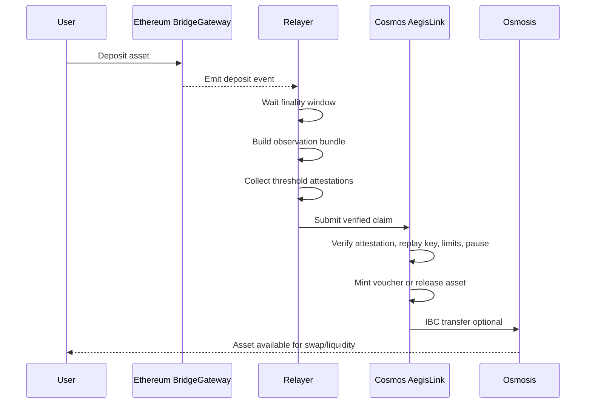

# AegisLink System Architecture

## Overview

AegisLink is an Ethereum-to-Cosmos interoperability layer designed as a protocol, not as a single-purpose app. In v1, it uses a verifiable-relayer model: Ethereum events are observed by an off-chain relayer set, converted into threshold attestations, and then verified by a Cosmos-SDK chain that acts as the bridge zone. In phase 2, the bridge zone routes assets onward to Osmosis over IBC for swaps and liquidity.

The bridge zone is the accounting and policy boundary. It is not just a message sink. It owns asset registration, replay protection, mint/burn or lock/unlock accounting, rate limits, and pause controls. It is the place where cross-chain claims become state changes.

## Goals

- Make the bridge easy to reason about as a system of bounded components.
- Separate observation, verification, policy enforcement, and token movement.
- Keep the v1 trust model explicit and narrow.
- Leave a clean path to replace the attestation model with an Ethereum light client in v2.

## Core Components

### Ethereum side

- `BridgeGateway` contracts emit canonical deposit and withdrawal events.
- `AssetRegistry` stores Ethereum-side metadata for supported assets.
- `PauseController` can halt new deposits, withdrawals, or both.
- `ThresholdAttestation` references are consumed by the bridge zone as proof artifacts.

### Off-chain relayer layer

- Watches Ethereum logs and finality signals.
- Builds observation bundles keyed by chain ID, tx hash, log index, and asset metadata.
- Collects or aggregates threshold attestations from authorized signers.
- Submits verified claims to the bridge zone.
- Can be fully replaced in v2 by a light-client verification path, but remains the v1 execution path.

### Bridge zone on Cosmos-SDK

- `bridge` module: verifies attestations, enforces replay protection, mints or releases representation assets, and tracks claim status.
- `registry` module: stores supported assets, decimal metadata, canonical denominations, and governance status.
- `limits` module: enforces per-asset and per-route throttles.
- `pauser` module: exposes chain-wide and asset-scoped emergency controls.
- `ibcrouter` module: forwards eligible assets to Osmosis over IBC after they exist on the bridge zone.

### Osmosis route

- The bridge zone is the source chain for phase 2 IBC transfers.
- Assets move from bridge-zone denominations into Osmosis through a predefined IBC channel.
- Osmosis receives them as standard IBC assets and can route them into swaps or liquidity pools.

## Message Interfaces

### Deposit claim

A deposit claim is the unit of work submitted to the bridge zone. It should include:

- source chain ID
- source contract address
- destination chain ID
- source transaction hash
- log index
- asset identifier
- amount
- recipient
- bridge nonce or unique claim key
- attestation set or aggregated proof

### Withdrawal claim

A withdrawal claim is the reverse direction:

- bridge-zone transaction hash
- burn or escrow event
- destination Ethereum address
- asset identifier
- amount
- withdrawal nonce
- attestation set or proof payload

### IBC transfer packet

For phase 2, the bridge zone emits standard IBC transfer packets with:

- source denom
- destination denom trace
- receiver on Osmosis
- timeout height or timestamp
- memo if needed for routing or observability

## Message Lifecycle

1. A user deposits an approved asset into the Ethereum gateway contract.
2. The gateway emits an event with enough data to reconstruct the claim.
3. Relayers wait for the configured finality depth and collect threshold attestations.
4. The bridge zone verifies the claim, checks uniqueness, and enforces policy.
5. The bridge zone mints a representation asset or unlocks the canonical asset on Cosmos.
6. If the route is enabled, the bridge zone forwards the asset to Osmosis over IBC.
7. The claim transitions to a terminal state and cannot be replayed.

## Asset Lifecycle

AegisLink supports a constrained set of assets, each with an explicit lifecycle.

1. The asset is registered with canonical metadata, decimals, source chain, and policy flags.
2. The first deposit creates a bridge-zone representation or accounting entry.
3. The representation can move within the bridge zone subject to rate limits and pause state.
4. A supported route can forward the asset to Osmosis over IBC.
5. A withdrawal burns the bridge-zone representation or returns an escrowed balance.
6. An attested claim releases the asset on Ethereum.

The important property is that every asset is always in one of a few well-defined states: locked, represented, routed over IBC, escrowed, burned, or released. There should be no hidden balance state.

## Bridge Zone Role

The bridge zone is the trust boundary where external claims become local state changes.

- It verifies that a claim is authorized by the expected threshold.
- It decides whether the claim is eligible for minting, unlock, or routing.
- It prevents duplicate execution using unique claim keys.
- It applies operational controls such as pause flags and rate limits.
- It serves as the bridge zone for phase 2 IBC routing, so Osmosis sees only the bridge zone as the source chain.

This role makes the bridge zone the protocol's accounting center, which keeps the system auditable and easier to extend later.

## Recommended Repo and Service Boundaries

For a recruiter-grade repository, keep the boundaries obvious:

- `contracts/ethereum/`: gateway contracts, registry, pause control, events, and tests.
- `apps/bridge-zone/`: Cosmos-SDK application wiring and module registration.
- `modules/bridge/`: claim verification, replay protection, state transitions, and accounting.
- `modules/registry/`: asset registry and denomination mapping.
- `modules/limits/`: per-asset and per-route throttles.
- `modules/pauser/`: emergency stop controls.
- `modules/ibcrouter/`: IBC transfer orchestration and Osmosis path configuration.
- `relayer/`: Ethereum watchers, attestation collection, claim submission, and metrics.
- `shared/types/`: message schemas, constants, and cross-component identifiers.
- `docs/`: architecture, security, and implementation specs.

Prefer a monorepo layout if the team is small, but keep service boundaries explicit so the relayer can be swapped independently of the chain modules.

## Interface Rules

- All cross-chain claims must be keyed by a unique, deterministic claim ID.
- The bridge zone must reject any claim that does not prove finality according to the configured policy.
- Asset metadata must be versioned, not overwritten in place.
- Pause and limit decisions must be checked before minting, burning, or IBC forwarding.
- Any route to Osmosis must be gated by a chain-owned allowlist and an initialized IBC channel.

## v1 to v2 Direction

v1 assumes a verifiable relayer with threshold attestations. v2 should preserve the same message model but replace the proof source with an Ethereum light client verifier on the bridge zone or an equivalent on-chain verification path. The architecture above is intentionally structured so the claim interface does not need to change when the trust model improves.
