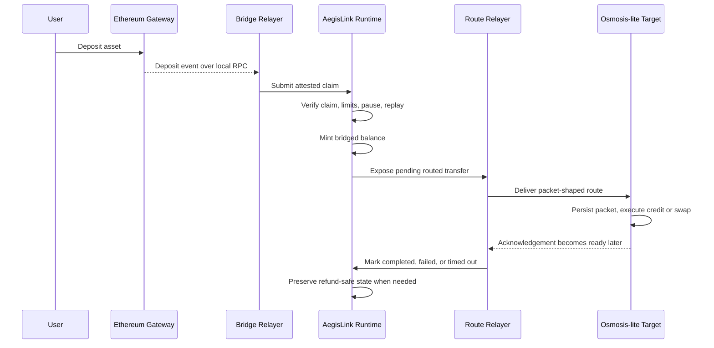
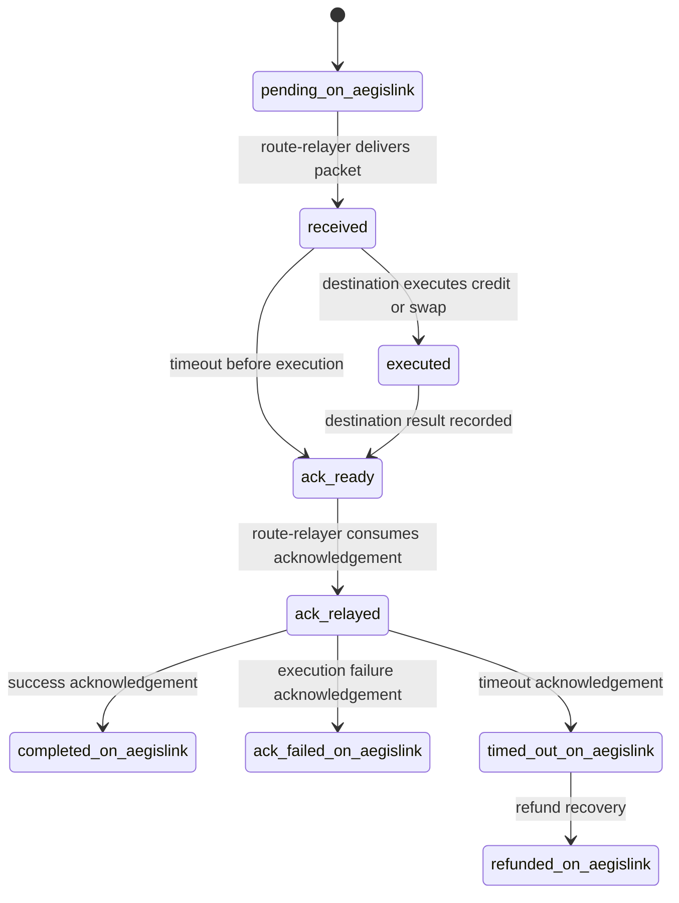

# AegisLink Current Flow Diagrams

These diagrams describe the repository as it exists today, not the long-term roadmap.

## End-to-end local bridge flow

## Destination route lifecycle

## Read these with the right lens

- `pending_on_aegislink` lives on the AegisLink side.
- `received`, `executed`, `ack_ready`, and `ack_relayed` live on the destination-side harness.
- `completed_on_aegislink`, `ack_failed_on_aegislink`, and `timed_out_on_aegislink` are the source-side route outcomes after acknowledgement processing.
- This is intentionally a strong local harness, not a claim that the repository already has live IBC, CometBFT, or a full Osmosis deployment.
