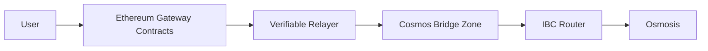

# AegisLink Architecture Spec

## Summary

AegisLink is a recruiter-grade Ethereum-to-Cosmos interoperability design centered on a v1 verifiable-relayer model and a v2 Ethereum light-client roadmap. The first release focuses on a custom Cosmos-SDK bridge zone that accepts threshold-attested Ethereum claims, enforces replay protection and policy controls, and can route assets onward to Osmosis over IBC.

The architecture is intentionally protocol-shaped:

- Ethereum is the source of canonical events.
- The relayer layer provides evidence, not trust.
- The bridge zone is the stateful verification and accounting boundary.
- Osmosis is reached through standard IBC routing from the bridge zone.

## Goals

- Make cross-chain asset movement auditable and deterministic.
- Keep v1 trust assumptions explicit and minimal.
- Preserve a stable claim interface so a future light client can replace the proof source.
- Present a system that feels like production protocol engineering rather than a demo bridge.

## Non-Goals

- Arbitrary message passing between Ethereum and Cosmos.
- Trustless Ethereum verification in v1.
- Support for every ERC-20 by default.
- Fully permissionless attester onboarding without a governance model.
- Hidden automation that bypasses on-chain accounting.

## Proposed Architecture

### Ethereum Layer

The Ethereum side exposes a gateway contract suite that emits canonical events for deposits and withdrawals. A registry defines which assets are supported, and a pause controller can stop new operations quickly if a problem is detected.

### Verifiable Relayer Layer

The relayer is an off-chain observation and attestation system. Its job is to watch Ethereum, wait for the configured finality depth, assemble a claim bundle, and collect threshold attestations from the authorized signer set. The relayer never becomes the source of truth; it only delivers evidence to the bridge zone.

### Cosmos Bridge Zone

The bridge zone is a Cosmos-SDK application with focused modules:

- `bridge` verifies claims and enforces replay protection.
- `registry` stores supported asset metadata and denomination mapping.
- `limits` applies rate limits to deposits, withdrawals, and routing.
- `pauser` provides emergency stop control.
- `ibcrouter` forwards eligible bridge-zone assets to Osmosis.

This makes the bridge zone the protocol's accounting center. Claims either become state or they do not. There is no implicit external ledger.

### Osmosis Routing

Once an asset exists on the bridge zone, a route can send it to Osmosis using standard IBC transfers. Osmosis then receives a normal IBC denomination, which can be used in swaps or liquidity provisioning without special-case handling.

## Data Flow

### Deposit Flow

1. A user deposits a supported asset into the Ethereum gateway contract.
2. The contract emits an event containing the asset, amount, recipient, and unique source identifiers.
3. The relayer observes the event and waits for finality.
4. The relayer collects the required threshold attestations.
5. The bridge zone verifies the attestation set, checks the claim key, and enforces pause and limit rules.
6. The bridge zone mints the representation asset or releases the escrowed balance.
7. If enabled, the asset is forwarded to Osmosis over IBC.

### Withdrawal Flow

1. A user burns or escrows the asset on the bridge zone.
2. The bridge zone emits a withdrawal record with a unique nonce.
3. The relayer observes the event and builds the proof bundle.
4. The attestations are collected and submitted back toward Ethereum.
5. The Ethereum gateway releases the canonical asset to the destination address.

### Routing Flow

1. The bridge zone receives a valid asset state.
2. The `ibcrouter` module checks whether the route is enabled and whether the channel is live.
3. The asset is transferred through the configured IBC path to Osmosis.
4. The transfer completes only if the timeout and channel constraints are satisfied.

## Error Handling

AegisLink should treat failures as explicit state transitions, not as silent retries.

- Invalid claims are rejected and recorded with a reason code.
- Duplicate claims are ignored after the first successful transition.
- Claims that fail finality or attestation checks remain unprocessed.
- Rate-limit violations return a deterministic rejection.
- Paused assets cannot mint, unlock, or route.
- IBC failures must leave the source asset state recoverable and observable.

The relayer may retry submission, but the chain must remain the authority on whether a claim is valid. That separation prevents an off-chain retry loop from becoming a security boundary.

## Security Model

v1 is a verifiable-relayer bridge. That means:

- the bridge zone verifies a threshold attestation, not an Ethereum light client proof
- the protocol depends on the integrity of the configured attester threshold
- replay protection, registry gating, pause controls, and rate limits are mandatory
- the protocol should not market itself as trustless in v1

This is deliberate. The v1 design provides a strong engineering baseline while leaving the proof source replaceable in v2.

## Testing Strategy

The design should be backed by tests that map directly to protocol risks.

### Unit tests

- claim key derivation
- attestation verification
- registry validation
- pause and rate-limit enforcement
- state machine transitions for mint, burn, release, and route

### Integration tests

- Ethereum event to bridge-zone mint flow
- duplicate claim rejection
- finality-window rejection
- paused asset behavior
- IBC transfer to Osmosis

### Property and invariant tests

- supply conservation across lock, mint, burn, and release paths
- claim id uniqueness
- no mint without attestation quorum
- no route without registry approval

### Adversarial tests

- forged signatures
- replayed claims
- out-of-order events
- relayer downtime
- IBC channel outage

## Roadmap

### v1

- Ethereum gateway contracts
- verifiable-relayer attestation path
- Cosmos-SDK bridge zone
- replay protection
- rate limits
- pause controls
- asset registry
- IBC routing to Osmosis

### v2

- Ethereum light-client verification path
- reduced trust in off-chain relayers
- clearer finality proofs from chain state itself
- optional deprecation of the attester quorum for deposit verification

## Recommended Repo Boundaries

Keep the implementation split so the protocol can evolve without large rewrites:

- Ethereum contracts in one package or workspace.
- Bridge-zone modules in a dedicated Cosmos app package.
- Relayer logic in a separate service package.
- Shared types and claim schemas in a small cross-language library.

That layout keeps the security boundary clear and makes the light-client upgrade path easier to execute later.

## Open Engineering Questions

- What finality threshold should be used for each supported Ethereum network?
- Should the attester set be global or per-asset?
- Which assets route to Osmosis by default and which require explicit enablement?
- How should governance update registry entries and signer sets?
- What level of failure telemetry should the relayer expose to operators?

## Conclusion

AegisLink v1 is a verifiable-relayer bridge that prioritizes explicit trust assumptions, deterministic accounting, and a clean upgrade path. It is designed to be strong enough for production-minded discussion today and extensible enough to justify a light-client roadmap tomorrow.
